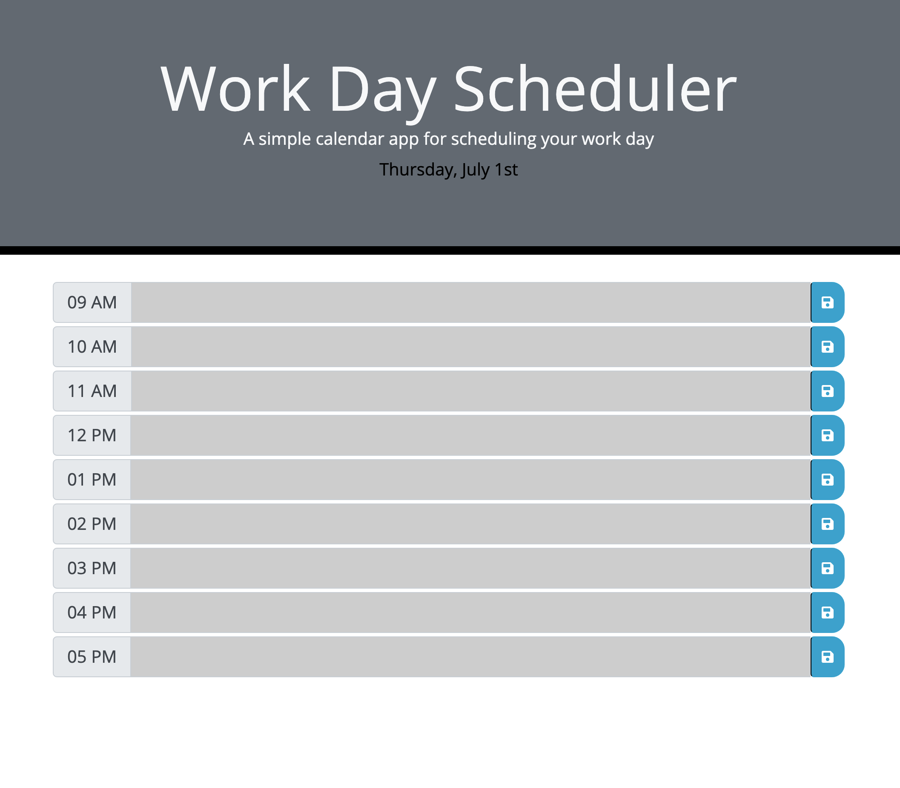

# Unit 05 HW: work-day-scheduler

## Description
This projects allows an user to organize and plan out their work day schedule. <br>
It shows the current date at the top and also shows the time slots that designated between work hour (9AM - 6PM). <br>
Users can type in their task or meeting in the text areas. <br>
Once user types in and click the save button, the data gets saved into the local storage. <br>
Since the data is saved, user will be able to access it even after they come back later. <br>
This scheduler keeps track of current time and changes the color of text area
depending on whether the time slot is past(gray), current(red), or future(green).

## Tasks Assigned

```
As an employee, I want to access the scheduler where I can add important events or notes in a daily planner so that I can manage my time effectively.
```

## Tasks Completed

```
As a developer who makes this scheduler,
The following tasks were completed to meet the criteria:
```
- [x] When the planner is opened, the current day is displayed at the top of the calendar
- [x] When user scrolls down the page, there are timeblocks for standard business hours
- [x] The timeblocks are color coded to indicate whether it is past/present/future
- [x] User is able to type their events or note in text area
- [x] When user clicks the save button, the corresponding text area in the timeblock is saved in local stroage
- [x] When user reloads the page, the saved events persist and display.

## Screenshot of the Website



## Links

Deployed Website Link: [https://rhwlffk1028.github.io/work-day-scheduler/](https://rhwlffk1028.github.io/work-day-scheduler/)

Code Repository Link: [https://github.com/rhwlffk1028/work-day-scheduler](https://github.com/rhwlffk1028/work-day-scheduler)

> **Note**: Use the first link above to access the website. By clicking the deployed webiste link, you will be directed to the web browser and it will be viewable.<br>
> **Note**: Use the second link above to access the repository where the html, css, and image files are live.

## Copyright
---
Copyright (c) [2021] [Jun Choi] <br>
Confidential and Proprietary. All Rights Reserved.